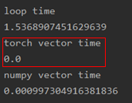

# （一）矢量运算效率比较


 一、 比较numpy、torch和循环累加三种方式下矢量相加的效率。

代码：

```python
import numpy as np
import time
import torch

 class Timer(object):
    
   def __init__(self):
     self.times = []
     self.start()
 
   def start(self):
     # start the timer
     self.start_time = time.time()
 
   def stop(self):
     # stop the timer and record time into a list
     self.times.append(time.time() - self.start_time)
     return self.times[-1]
 
 
 # torch
 n = 100000
 a = torch.ones(n)
 b = torch.ones(n)
 c = torch.ones(n)
 
 timer = Timer()
 for i in range(100000): # 循环累加
   c[i] = a[i] + b[i]
 print("loop time")
 print(timer.stop())
 
 timer.start()
 c = a + b # torch向量运算
 print("torch vector time")
 print(timer.stop())
 
 # numpy
 arr1 = np.random.rand(100000)
 arr2 = np.random.rand(100000)
 timer.start()
 c = arr1 + arr2 # numpy向量运算
 print('numpy vector time')
 print(timer.stop())
```

结果截图：




结果分析：

利用numpy或torch创建数组并直接进行向量运算的时间效率相差无几，效率均极高（有时甚至是0）。远高于循环累加的效率。因此平时计算时应尽量避免循环，而是选择向量运算。
