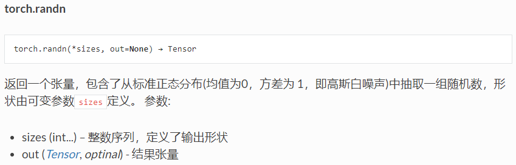
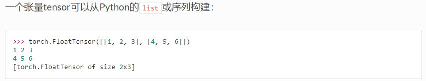
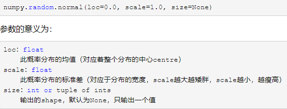

#（三）利用Pytorch和Numpy生成散点

在生成数据集的过程中，用到了两个函数生成随机的散点集：

```python
torch.randn(num_examples, num_inputs, dtype=torch.float32)  # 生成num_examples*num_inputs大小的矩阵即1000行*2列,[x1,x2]

torch.tensor(np.random.normal(0, 0.01, size=labels.size()), dtype=torch.float32) 
# 生成噪声，即y的细小误差
```

通过查阅文档，简单解释：

1、 torch.randn​



其中*sizes是可变参数。

2、torch.tensor



3、np.random.normal

